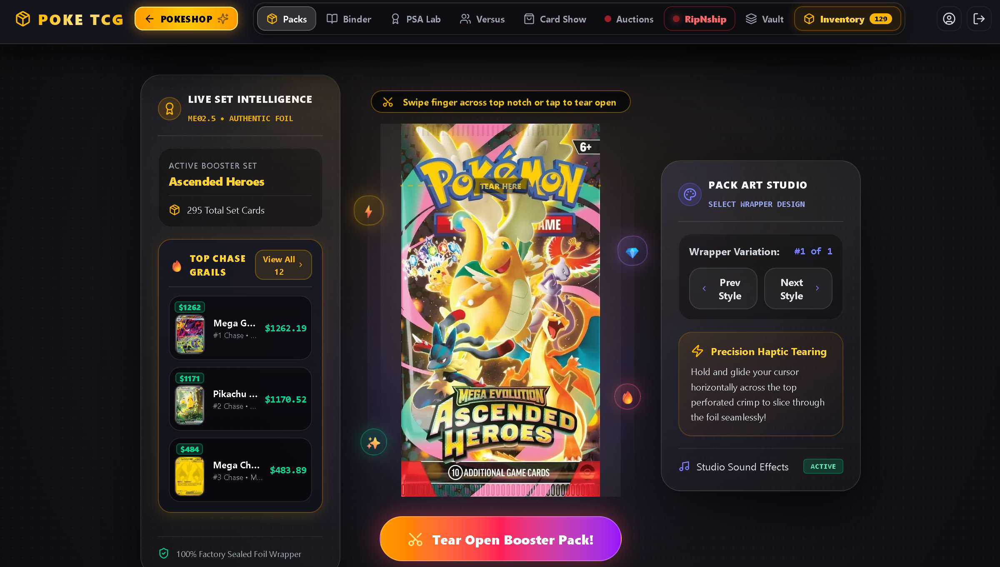
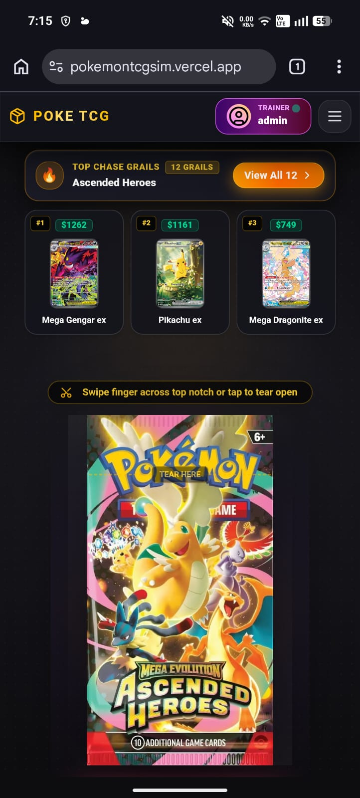

<div align="center">

  # 🎴 Pokémon TCG Simulator

  <p align="center">
    <b>The Ultimate 3D Pack Opening, Rip N' Ship Live Stream & Card Collection Experience</b>
  </p>

  <p align="center">
    <a href="https://pokemontcgsim.vercel.app/">
      
    </a>
  </p>

  <!-- Colorful Technology & Status Badges -->
  <p align="center">
    
    
    
    
    
    
    
    
  </p>

  <p align="center">
    <a href="https://pokemontcgsim.vercel.app/"><b>✨ Launch App</b></a> •
    <a href="#-interface-showcase"><b>📸 Showcase</b></a> •
    <a href="#-key-features"><b>🔥 Features</b></a> •
    <a href="#-mobile-first--touch-experience"><b>📱 Mobile</b></a> •
    <a href="#-generation--set-coverage"><b>⚡ Sets & Eras</b></a> •
    <a href="#-quick-start"><b>🚀 Quick Start</b></a>
  </p>

</div>

---

## 🌈 Highlights

> [!TIP]
> **Live Web Application**: Open packs in your browser right now at **[pokemontcgsim.vercel.app](https://pokemontcgsim.vercel.app/)** with zero installation required!

```
 ┌──────────────────────────────────────────────────────────────────────────┐
 │ 🎴 3D Pack Tear Arena   │ 📺 Rip N' Ship Live Stream  │ 🏆 PSA Binder    │
 │    Physic-based foil    │    Simulated stream host    │    Grading Lab & │
 │    tear & holo shimmer  │    with real viewer orders  │    Market P/L    │
 └──────────────────────────────────────────────────────────────────────────┘
```

---

## 📸 Interface Showcase

<div align="center">
  <table>
    <tr>
      <td width="68%" align="center" valign="top">
        <h3>🖥️ Desktop Main Page</h3>
        <a href="docs/assets/desktop-preview.png">
          
        </a>
      </td>
      <td width="32%" align="center" valign="top">
        <h3>📱 Mobile Main Page</h3>
        <a href="docs/assets/mobile-preview.png">
          
        </a>
      </td>
    </tr>
  </table>
</div>

---

## 🔥 Key Features

<table>
  <tr>
    <td width="50%" valign="top">
      <h3 align="center">⚡ 3D Pack Opening Engine</h3>
      <ul>
        <li><b>Haptic Foil Tear:</b> Drag to physically slice open booster wrappers.</li>
        <li><b>3D Holographic Tilt:</b> Real-time GPU <code>rotateX/rotateY</code> tilt with color extraction.</li>
        <li><b>Shimmer Shaders:</b> Holofoil, Reverse-Holo, Rainbow & Secret Rare shine effects.</li>
        <li><b>Era-Calibrated Drop Odds:</b> Authentic pull rate probability models from WOTC Base Set to Mega Evolution.</li>
      </ul>
    </td>
    <td width="50%" valign="top">
      <h3 align="center">📺 "Rip N' Ship" Stream Host</h3>
      <ul>
        <li><b>Live Stream Simulator:</b> Host a stream with active viewer chat & donations.</li>
        <li><b>Order Ripping Queue:</b> Fulfill pack orders for stream viewers in real time.</li>
        <li><b>Chase Grail Alerts:</b> Sound effects & celebration animations when pulling top grails.</li>
        <li><b>Stream Revenue Analytics:</b> Live session revenue & cost metrics.</li>
      </ul>
    </td>
  </tr>
  <tr>
    <td width="50%" valign="top">
      <h3 align="center">🏆 Binder & Portfolio Manager</h3>
      <ul>
        <li><b>9-Pocket Binders:</b> Organize cards into custom binders with penny sleeves.</li>
        <li><b>Real-Time Market Value:</b> Live portfolio metrics synced with TCGPlayer & CardMarket.</li>
        <li><b>PSA Grading Lab:</b> Submit cards for simulated PSA gem mint grading.</li>
        <li><b>Restoration Workshop:</b> Clean & restore vintage cards.</li>
      </ul>
    </td>
    <td width="50%" valign="top">
      <h3 align="center">🏪 Virtual Card Show</h3>
      <ul>
        <li><b>Vendor Marketplace:</b> Browse vendor booths & haggle prices for rare singles.</li>
        <li><b>Live Auctions:</b> Bid on grail cards in active auction rounds.</li>
        <li><b>Trade Studio:</b> Trade binder duplicates with virtual collectors.</li>
        <li><b>Japanese & English Sets:</b> Seamless support for both EN & JP sets.</li>
      </ul>
    </td>
</table>

---

## 📱 Mobile-First & Touch Experience

<p align="center">
  
  
  
  
</p>

> [!NOTE]
> **Built for Mobile & Touch**: The entire application is engineered from the ground up to deliver a native app-like experience on smartphones and tablets. Whether tearing open booster foil wrappers with a swipe or browsing binders on mobile web browsers, everything runs butter-smooth at 60fps.

<p align="center">
  <a href="docs/assets/mobile-preview.png">
    
  </a>
</p>

```
 ┌──────────────────────────────────────────────────────────────────────────┐
 │ 👆 Multi-Touch Tear   │ 📱 Responsive Drawers  │ ⚡ 60FPS GPU Shimmer    │
 │    Physical swipe to  │    Mobile menu drawer  │    Touch 3D tilt &      │
 │    tear foil wrappers │    & bottom action bar │    lightweight shaders  │
 └──────────────────────────────────────────────────────────────────────────┘
```

<table width="100%">
  <tr>
    <td width="50%" valign="top">
      <h4>🖐️ Touch-Native Interactions</h4>
      <ul>
        <li><b>Multi-Touch Foil Tear:</b> Swipe & drag across touchscreen surfaces to physically slice open booster wrappers.</li>
        <li><b>Tap & Long-Press Controls:</b> Instant card flip animations, tap-to-inspect grails, and drag-and-drop binder transfers.</li>
        <li><b>Haptic Audio Feedback:</b> Real-time sound effects for foil tearing, card flipping, and rare card pulls on mobile devices.</li>
      </ul>
    </td>
    <td width="50%" valign="top">
      <h4>📐 Adaptive Mobile Architecture</h4>
      <ul>
        <li><b>Dynamic Grid Scaling:</b> Automatically switches from 2-column mobile grids (<code>grid-cols-2</code>) to 5-column desktop displays.</li>
        <li><b>Mobile Drawer & Bottom Bar:</b> One-thumb navigation drawer for seamless tab switching on mobile devices.</li>
        <li><b>Viewport-Height Safety:</b> Touch-safe modal sheets and full-screen viewports optimized for iOS Safari notch & gesture bar.</li>
      </ul>
    </td>
  </tr>
</table>

---

## ⚡ Generation & Set Coverage

Supported card sets and authentic drop mechanics spanning **25+ years of TCG history**:

<div align="center">

| Era / Generation | Release Years | Special Mechanics & Card Tiers | Hit Odds Model |
| :--- | :---: | :--- | :---: |
|  | 1999–2002 | 1st Edition, Holo Rares, Base Set, Jungle, Fossil, Rocket | **~33% Holo** |
|  | 2003–2007 | Pokémon ex, Gold Star ⭐, Delta Species | **~33% Hit Rate** |
|  | 2007–2010 | Level X (Lv.X), Secret Rares | **~33% Hit Rate** |
|  | 2010–2011 | Prime Cards, LEGEND Half-Cards, Alph Lithograph | **~33% Hit Rate** |
|  | 2011–2013 | Full Art EX, Shiny Rares, Secret Gold Rares | **~33% Hit Rate** |
|  | 2013–2016 | Mega EX 🧬, BREAK Cards ⚡, Secret Rares | **Realistic Odds** |
|  | 2017–2019 | Pokémon-GX, Rainbow Secret Rares, Prism Star ♢ | **Realistic Odds** |
|  | 2020–2023 | Pokémon V/VMAX/VSTAR, Trainer Gallery, Secret Gold | **Guaranteed Holo** |
|  | 2023–Present | ex Cards, Illustration Rare (IR), SIR, Hyper Rare | **Modern Pull Rates** |
|  | 2025–Present | Mega Evolution (ME), Phantasmal & Ascension Series | **Next-Gen Rates** |

</div>

---

## 🛠️ Technology Stack

<div align="center">

| Layer | Badges / Libraries |
| :--- | :--- |
| **Frontend Framework** |    |
| **Styling & UI** |    |
| **3D & Shimmer Effects** |   |
| **Data APIs** |    |
| **Backend & Sync** |  |

</div>

---

## 🚀 Quick Start

```bash
# 1️⃣ Clone the repository
git clone https://github.com/sohamSanat/PokemonTcgSimulator.git

# 2️⃣ Enter project root
cd PokemonTcgSimulator

# 3️⃣ Install all dependencies
npm install

# 4️⃣ Launch local dev server
npm run dev
```

> [!NOTE]
> The app will automatically generate the asset manifests and launch locally at **`http://localhost:5173`** with zero configuration required!

---

## 📁 Project Architecture

```
PokemonTcgSimulator/
├── BackEnd/                    # Backend price generation & scraping scripts
└── FrontEnd/
    └── PackOpeningUI/          # Main React + Vite SPA
        ├── public/
        │   └── packArts/       # Curated booster pack wrapper arts by set
        ├── src/
        │   ├── app/
        │   │   ├── components/ # Component modules
        │   │   │   ├── auction/        # Live auction house
        │   │   │   ├── binder/         # 3D Binder & collection manager
        │   │   │   ├── cardShow/       # Virtual card show marketplace
        │   │   │   ├── psa/            # PSA grading studio
        │   │   │   └── ripNship/       # Rip N' Ship live stream simulator
        │   │   ├── services/   # TCGdex, Scrydex & Firestore API clients
        │   │   └── data/       # Set pricing & pack configuration datasets
        │   └── styles/         # Custom holofoil CSS shaders & animations
        └── vite.config.ts
```

---

<div align="center">
  <p><b>Created with ❤️ for Pokémon TCG Collectors Worldwide</b></p>
  <p>
    <a href="https://pokemontcgsim.vercel.app/">
      
    </a>
  </p>
</div>
